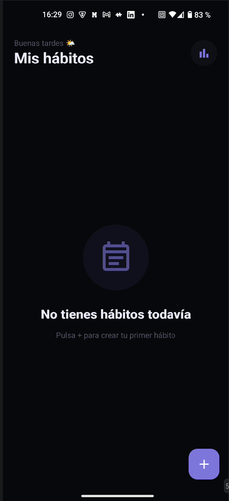
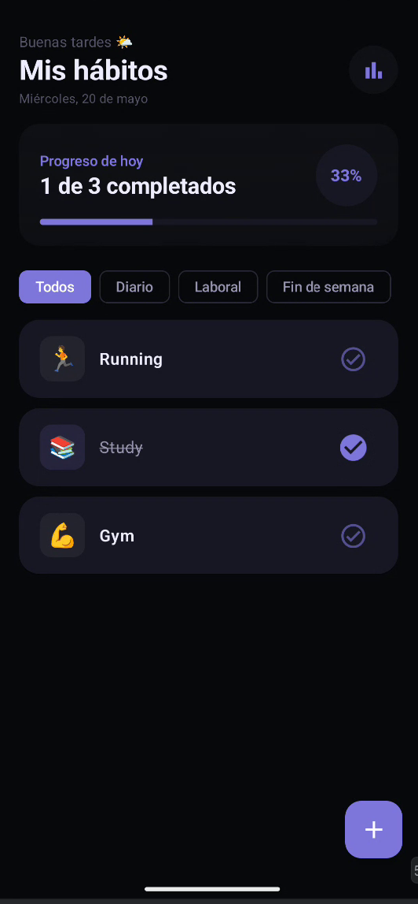
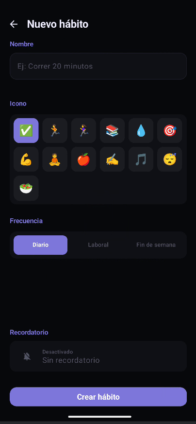
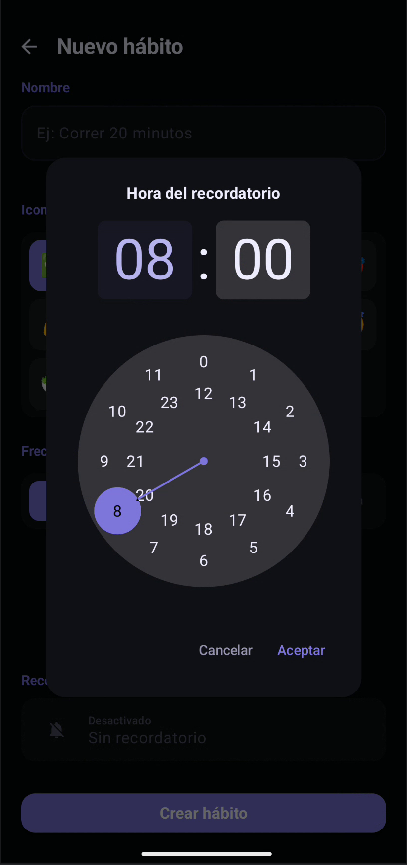
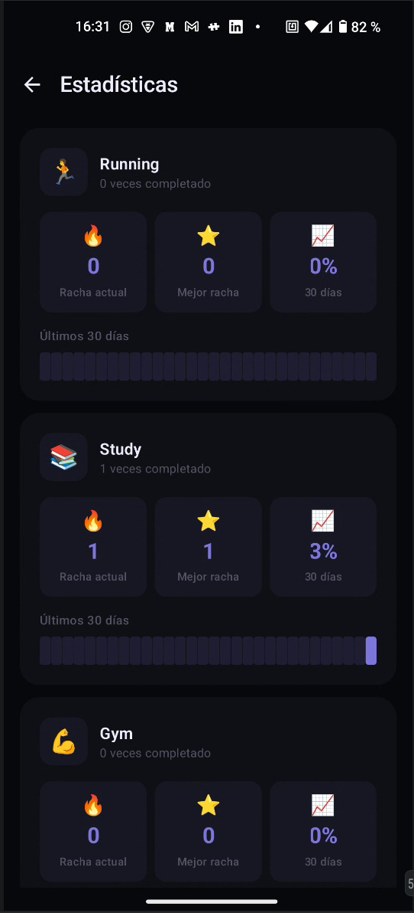
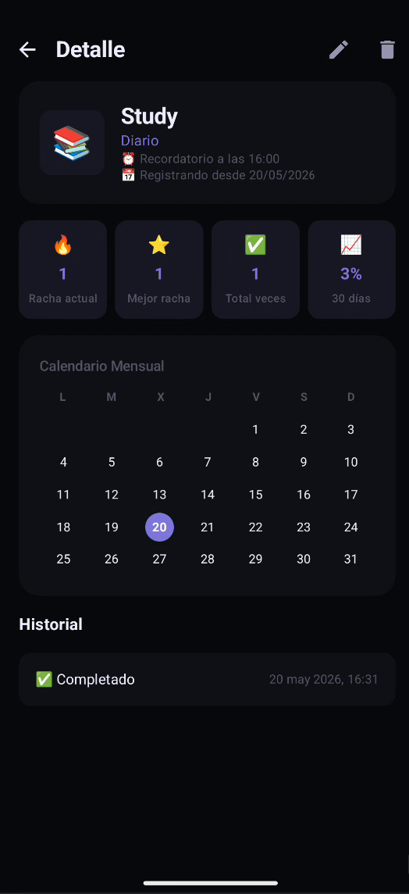

<h1 align="center">Habit Tracker 📋</h1>

<p align="center">
  <a href="https://android-arsenal.com/api?level=26"></a>
  <a href="https://kotlinlang.org"></a>
  <a href="https://developer.android.com/jetpack/compose"></a>
  
</p>

<p align="center">
Aplicación Android nativa para crear y seguir hábitos diarios.<br>
Construida con Kotlin y Jetpack Compose aplicando Clean Architecture.
</p>

---

## 📸 Capturas de pantalla

<p align="center">
  
  
  
  
  
  
</p>

---

## ✨ Funcionalidades

- **Crear hábitos** con nombre, emoji personalizado y frecuencia (diario / días laborales / fin de semana)
- **Marcar como completado** con animación visual y texto tachado
- **Swipe para eliminar** con acción de deshacer (Snackbar)
- **Editar hábito** mediante long press directo desde la lista
- **Pantalla de detalle** con calendario mensual e historial completo de registros
- **Estadísticas** por hábito: racha actual, mejor racha, tasa de cumplimiento y heatmap de 30 días
- **Recordatorios múltiples** por hábito configurables con TimePicker
- **Widget** en pantalla de inicio actualizado en tiempo real (Glance)
- **Filtros** por frecuencia en la pantalla principal
- **Progreso diario** con barra de progreso y porcentaje
- **Dark mode** con tema morado consistente en toda la app
- **8 tests unitarios** cubriendo casos críticos de negocio y ViewModels

---

## 🏗️ Arquitectura

El proyecto sigue **Clean Architecture** en un único módulo, separado en tres capas:

```
presentation/   →   domain/   →   data/
    ↑                  ↑              ↑
  Screens           Use Cases       Room
  ViewModels        Repository      Mappers
  Components        Models          Entities
```

```
app/
├── data/
│   ├── local/              # HabitEntity, HabitLogEntity, HabitDao, HabitDatabase
│   ├── mapper/             # HabitMapper (Entity ↔ Domain)
│   ├── manager/            # WorkManagerReminderManager, WorkManagerWidgetManager
│   └── repository/         # HabitRepositoryImpl
├── domain/
│   ├── model/              # Habit, HabitLog, HabitFrequency
│   ├── repository/         # HabitRepository (interfaz)
│   ├── manager/            # ReminderManager, WidgetManager (interfaces)
│   └── usecase/            # CreateHabit, EditHabit, DeleteHabit, CompleteHabit,
│                             GetHabits, GetTodayLogs, GetHabitStats
├── presentation/
│   ├── home/               # HomeScreen + HomeViewModel + HabitItem
│   ├── create/             # CreateHabitScreen + ViewModel
│   ├── edit/               # EditHabitScreen + ViewModel
│   ├── detail/             # HabitDetailScreen + ViewModel
│   ├── stats/              # StatsScreen + StatsViewModel + HabitHeatmap
│   └── components/         # HabitCalendar, MultiReminderSelector
├── di/                     # AppModule, ManagerModule, WorkManagerHelper
├── widget/                 # HabitWidget (Glance), HabitWidgetReceiver
├── worker/                 # HabitReminderWorker
└── notification/           # HabitNotificationHelper
```

---

## 🛠️ Tech Stack

### Android Jetpack
| Librería | Uso |
|---|---|
| [Jetpack Compose](https://developer.android.com/jetpack/compose) | UI declarativa 100% nativa |
| [Navigation Compose](https://developer.android.com/jetpack/compose/navigation) | Navegación entre pantallas |
| [ViewModel](https://developer.android.com/topic/libraries/architecture/viewmodel) | Gestión del estado de UI |
| [Room](https://developer.android.com/jetpack/androidx/releases/room) | Persistencia local con SQLite |
| [WorkManager](https://developer.android.com/topic/libraries/architecture/workmanager) | Tareas en background y recordatorios |
| [Glance](https://developer.android.com/jetpack/compose/glance) | Widget en pantalla de inicio |
| [Hilt](https://developer.android.com/training/dependency-injection/hilt-android) | Inyección de dependencias |

### Kotlin
| Librería | Uso |
|---|---|
| [Coroutines](https://github.com/Kotlin/kotlinx.coroutines) | Programación asíncrona |
| [Flow / StateFlow](https://developer.android.com/kotlin/flow) | Streams reactivos de datos |

### Testing
| Librería | Uso |
|---|---|
| [JUnit 4](https://junit.org/junit4/) | Tests unitarios |
| [MockK](https://mockk.io/) | Mocking en Kotlin |
| [Mockito](https://github.com/mockito/mockito-kotlin) | Mocking adicional |
| [Turbine](https://github.com/cashapp/turbine) | Testing de Flows |
| [Coroutines Test](https://github.com/Kotlin/kotlinx.coroutines/tree/master/kotlinx-coroutines-test) | Testing de coroutines |

---

## 🧪 Tests

```
CreateHabitUseCaseTest
  ✓ cuando el nombre está en blanco, devuelve error y no llama al repositorio
  ✓ cuando el nombre es válido, inserta el hábito y devuelve success

GetHabitStatsUseCaseTest
  ✓ sin logs, las rachas son cero
  ✓ completado hoy, la racha actual es 1
  ✓ completado 3 días consecutivos, la mejor racha es 3

CreateHabitViewModelTest
  ✓ al cambiar el nombre, el state se actualiza
  ✓ creación exitosa: transición loading → success
  ✓ creación fallida: error se propaga al state

HomeViewModelTest
  ✓ al cargar hábitos, el state los contiene
  ✓ al completar un hábito, su id aparece en completedHabitIds
  ✓ al eliminar un hábito, se muestra el mensaje de deshacer
```

Para ejecutarlos:
```bash
./gradlew test
```

---

## 🚀 Instalación

```bash
git clone https://github.com/fernando-villalba-varela/Habit-Tracker.git
```

1. Abre el proyecto en **Android Studio Ladybug** o superior
2. Espera a que Gradle sincronice
3. Ejecuta en un dispositivo o emulador con **API 26+**

No se necesita ninguna configuración adicional ni API keys.

---

## 📐 Decisiones técnicas

- `GetHabitsUseCase` filtra automáticamente por día de la semana según la frecuencia del hábito (WEEKDAYS solo lunes–viernes, WEEKENDS solo sábado–domingo).
- `filteredHabits` es un `StateFlow` independiente en `HomeViewModel` para que los filtros de la UI no alteren el conteo de progreso global.
- Tap en `HabitItem` → pantalla de detalle. Long press → editar.
- El widget usa `getActiveHabitsOnce()` (suspending) en lugar de un Flow para evitar el lock conocido de 45–50s de Glance AppWidget.

---

## 📄 Licencia

```
MIT License

Copyright (c) 2026 Fernando Villalba Varela

Se concede permiso, de forma gratuita, a cualquier persona que obtenga una copia
de este software para usarlo, copiarlo, modificarlo, fusionarlo, publicarlo,
distribuirlo, sublicenciarlo y/o venderlo, sujeto a las condiciones del archivo LICENSE.
```
